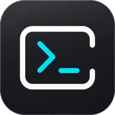
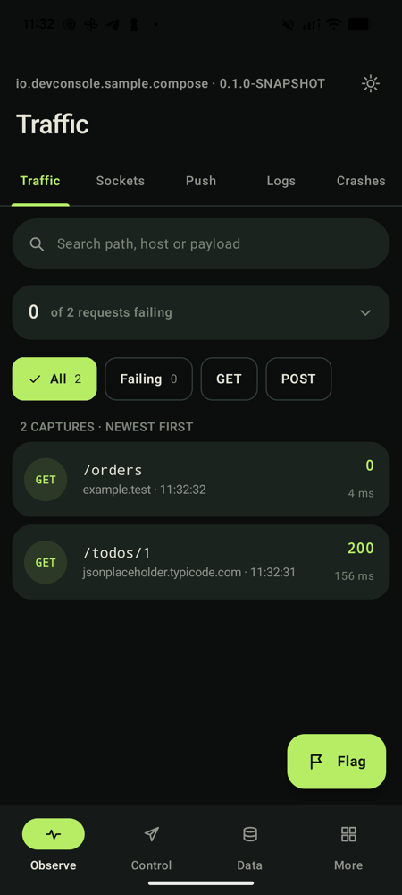
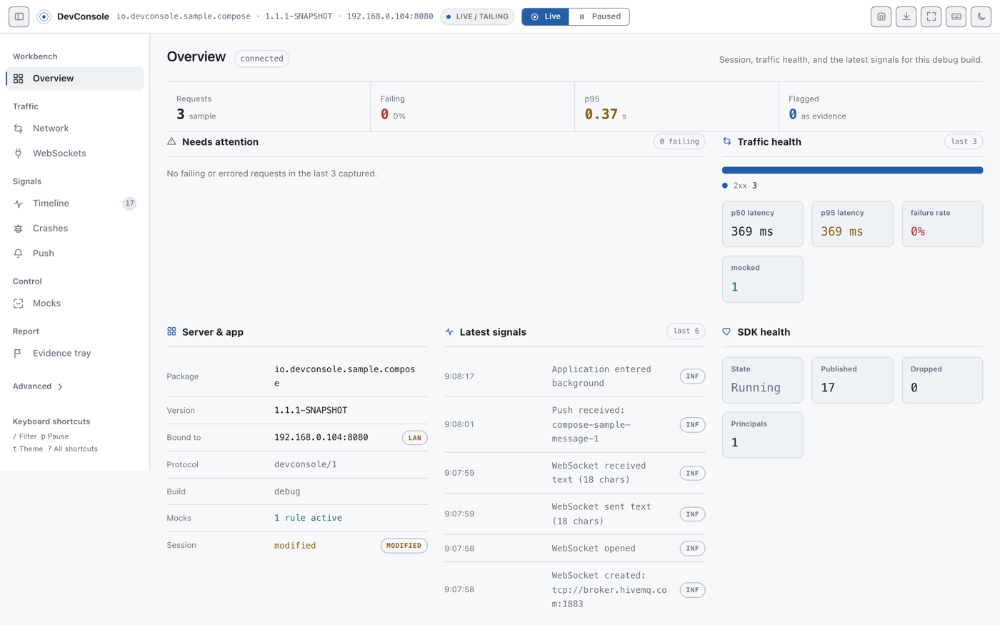
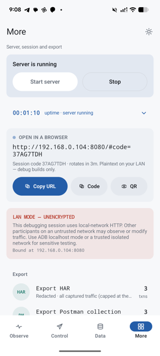
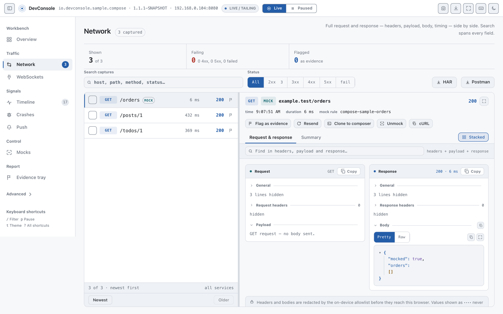

<div align="center">



# DevConsole

**An in-app debugger for Android, with a browser dashboard for when you want a bigger screen.**

[](https://central.sonatype.com/artifact/io.github.devconsole-android/devconsole)
[](LICENSE)
[](#compatibility)
[](https://github.com/devconsole-android/DevConsole/actions/workflows/verify.yml)

<br />

&nbsp;&nbsp;

</div>

Shake your debug build and DevConsole opens on top of it. Network traffic, crashes and ANRs,
feature flags, SharedPreferences, SQLite, files — all of it on the device, no cable required.

When a phone screen isn't enough, start the embedded server and the same data live-tails into any
browser, where you can also edit mock rules and export HAR, Postman, or a whole bug report.

Your release build never sees any of it. It compiles against a no-op twin that records nothing and
links no server code, and the Gradle plugin fails the build if the real runtime ever slips in.

**Contents** · [Quick start](#quick-start) · [What you get](#what-you-get) ·
[How it works](#how-it-works) · [Guide](#step-by-step-guide) · [Artifacts](#artifacts) ·
[Permissions](#permissions) · [Security](#security-model) · [Samples](#sample-apps) ·
[Docs](#documentation)

## Quick start

**1. Add the plugin and two dependencies** to your app's `build.gradle.kts`:

```kotlin
plugins {
    id("com.android.application")
    id("io.github.devconsole-android") version "1.2.1"
}

dependencies {
    debugImplementation("io.github.devconsole-android:devconsole:1.2.1")
    releaseImplementation("io.github.devconsole-android:devconsole-noop:1.2.1")
}
```

**2. Open the inspector on the device.** The SDK auto-initializes on debuggable builds, so this
works right away from any button in your debug UI:

```kotlin
DevConsole.open(context)
```

Or go hands-free. Opt into the built-in triggers and shake the device, or tap a draggable floating
button:

```kotlin
DevConsole.initialize(
    application,
    DevConsoleConfig.default()
        .withOpenTriggers(OpenTriggers(shakeToOpen = true, floatingButton = true)),
)
```

That's the setup. You now have crash and ANR reports, feature flags, and read-only inspectors for
SharedPreferences, SQLite, and files. Add one line to your HTTP client
(see [Wire up your network stack](#wire-up-your-network-stack)) and network, WebSocket, and MQTT
traffic show up too.

**3. Want a bigger screen? Start the browser dashboard.** Tap **Start server** on the inspector's
**More** screen and it hands you a connect URL and a QR code. You can also do it from code. Either
way your manifest needs `INTERNET`, which most apps already declare:

```kotlin
lifecycleScope.launch { // startBrowser is a suspend function; the server never starts on its own
    val result = DevConsole.startBrowser(StartRequest())
    val connectUrl = (result as? StartResult.Started)?.access?.connectUrl
    // e.g. http://192.168.0.15:8080/#code=B7KQ2XWZ — surface this in your debug UI
}
```

The default binding is `BindingMode.AUTO`: it binds your device's network address when there is one,
so the URL opens from any machine on the same Wi-Fi, and falls back to `127.0.0.1` when there isn't.
If it fell back — or if you passed `BindingMode.LOOPBACK` to keep it off the network on purpose —
forward the port first:

```bash
adb forward tcp:8080 tcp:8080   # use the port from the loopback start's log line
```

Then open the **whole URL**. The `#code=` fragment is the credential, so a bare `http://host:port/`
gets you nothing.

> **The dashboard speaks plaintext HTTP.** On a network address, everything it shows — headers,
> tokens, bodies — is readable by anyone who can see your traffic. That is fine on a home or office
> Wi-Fi and a bad idea on a conference or café network. Pass `BindingMode.LOOPBACK` to rule it out,
> and read [the threat model](docs/THREAT_MODEL.md).

## What you get

| Area | What it does |
|---|---|
| **In-app inspector** | `DevConsole.open(context)` shows every inspector below as an on-device screen (included with `devconsole`), plus a QR code for pairing the browser. Opens by shake (adjustable intensity) or draggable floating button via the opt-in `DevConsoleConfig.openTriggers` flags. Its More screen can also start and stop the dashboard server. |
| **Network inspector** | Every HTTP call with headers, bodies, and a DNS/TCP/TLS/send/wait/receive timing bar. Live-tails as traffic happens. |
| **WebSocket & MQTT inspectors** | Connection lifecycles and every frame, inbound and outbound. MQTT rides the Eclipse Paho adapter. |
| **Mock rules** | Serve canned responses for matching requests (OkHttp), toggled from the dashboard, with deterministic priority matching. Wired by `installDevConsole` and editable out of the box. |
| **Request composer** | Make the device issue ad-hoc HTTP requests from the dashboard. Off by default, host-allowlist confinable. |
| **Crash & ANR capture** | Uncaught exceptions and a main-looper watchdog with bounded all-thread dumps and breadcrumbs. Always delegates to any crash reporter you already have. |
| **Push timeline** | Record FCM (or any) push messages and their lifecycle: received → displayed → opened. The Firebase adapter uses reflection — no compile-time Firebase dependency. |
| **State & feature flags** | Snapshot host-registered state and override feature flags from the browser. |
| **Remote Config inspector** | Every Remote Config value active on the device, and where each one came from — server, in-app default, static fallback, or a local override — plus last fetch time and status. Read-only. The Firebase adapter uses reflection — no compile-time Firebase dependency. |
| **Data inspectors** | Browse SharedPreferences, SQLite (incl. a SQL console), and app files. Read-only by default; every edit surface is opt-in. |
| **Evidence tray & exports** | Flag anything, attach it to a bug report bundle or Markdown/Jira/GitHub clipboard text. Export HAR, Postman Collection, or a full session ZIP. |
| **Background keep-alive** | Opt-in foreground service that keeps the server alive while your app is backgrounded. Manifest-only opt-in, zero SDK-declared permissions. |

Capture is category-scoped. `DevConsoleConfig.withCaptureCategories(...)` narrows what gets
recorded to any of `NETWORK`, `SOCKET`, `MQTT`, `PUSH`, `LOGS`, `CRASHES`, `STATE`, `INSPECTION`,
and `MOCKS`. All of them are on by default. Events land in a Room database with a retention policy
that defaults to 7 days or 100 MB, whichever comes first.

## How it works

`devconsole` (debug) and `devconsole-noop` (release) expose the **same public API**. The no-op twin
records nothing, serves nothing, and links no server code. Production safety comes from which
artifact you depend on, not from a runtime flag someone can forget to set.

The Gradle plugin (`io.github.devconsole-android`) wires that debug/release split for you if you
omit the dependencies. It then checks three things: your declared dependencies, the resolved runtime
classpath, and the bytes in the final APK or AAB. If the full runtime reaches a protected variant,
the build fails.

On debuggable builds the SDK initializes itself from its own `ContentProvider`, so there is no
`Application.onCreate` boilerplate. The server is the exception: it never auto-starts. You always
call `startBrowser(...)` yourself.

## Step-by-step guide

### Open the in-app inspector

`DevConsole.open(context)` opens the inspector from any trigger you like and returns an
`InspectorOpenResult`. If you'd rather not write that call, opt into the built-in triggers. Both are
off by default, and neither ever starts the server:

```kotlin
DevConsoleConfig.default().withOpenTriggers(
    OpenTriggers(
        shakeToOpen = true,
        shakeIntensity = ShakeIntensity.MEDIUM, // LIGHT | MEDIUM | FIRM
        floatingButton = true,
    ),
)
```

The floating button is **draggable**. Press and move it anywhere on screen and it stays there across
Activity changes and rotation, re-clamping into the window so it can never strand itself off-screen.
It sits at 65% opacity so it doesn't hide your UI, and goes fully opaque while you touch it. A drag
never counts as a tap, so moving it won't open the inspector.

Both triggers are **UI-framework agnostic**. The button is a plain `ImageView` on the Activity's
decor view and the shake detector is a sensor listener, so an XML/Views or Java host behaves exactly
like a Compose one, with no `ui-compose` or `ui-views` dependency involved. In Java that reads
`OpenTriggers.builder().shakeToOpen(true).floatingButton(true).build()`, as
[`views-java-app`](samples/views-java-app) does.

Java: `DevConsoleConfig.builder().openTriggers(OpenTriggers.builder().shakeToOpen(true).build())`.

### Start and stop the dashboard server

No code required. The inspector's **More** screen has Start and Stop buttons, and once the server is
up it shows the live connect URL three ways: as text, behind a copy button, and as a QR code you can
scan from another machine.

<p align="center"></p>

That button binds **AUTO** by default, so on a device with a live Wi-Fi or Ethernet connection the
QR code is scannable from another machine straight away, and on one without it the URL falls back to
`127.0.0.1` and needs `adb forward`. The button issues no `StartRequest` of its own, so if you want
to pin it, declare it on the config:

```kotlin
// Never touch the network:
DevConsoleConfig.default().withBrowserConfig(BrowserConfig(binding = BrowserBinding.LOOPBACK))

// Require the network — fails loudly instead of falling back, and surfaces the
// ACCESS_LOCAL_NETWORK prompt on API 37+ devices:
DevConsoleConfig.default().withBrowserConfig(
    BrowserConfig(binding = BrowserBinding.LOOPBACK),
)
```

This is independent of the `bindingMode` you pass to `startBrowser` yourself; set both if you start
the server from your own UI too. Read [the threat model](docs/THREAT_MODEL.md) before leaving either
one on the network.

From code:

```kotlin
// Optional — auto-init already ran on debuggable builds. Call it yourself to customize:
DevConsole.initialize(application, DevConsoleConfig.default())

// startBrowser and stop are suspend functions — call them from a coroutine:
val result = DevConsole.startBrowser(StartRequest()) // BindingMode.AUTO
when (result) {
    is StartResult.Started -> {
        result.endpoint              // host + port actually bound; bindingMode is LOOPBACK or LAN,
                                     // never AUTO — it reports the socket, not the request
        result.access.connectUrl     // the full credential URL — treat as a secret
    }
    is StartResult.PermissionRequired -> { /* explicit LAN only: request result.permission */ }
    else -> { /* NoEligibleNetwork, ServerUnavailable, ... */ }
}

DevConsole.stop(StopReason.UserRequested)
```

Java is fully supported via async variants and builders:

```java
DevConsole.initialize(getApplication(), DevConsoleConfig.builder().build());
StartRequest request = new StartRequest(BindingMode.LAN, new kotlin.ranges.IntRange(8080, 8099));
DevConsole.startBrowserAsync(request, result -> runOnUiThread(() -> {
    if (result instanceof StartResult.Started) {
        StartResult.Started started = (StartResult.Started) result;
        String url = started.getAccess().getConnectUrl();
    }
}));
```

### Find the connect URL

After `startBrowser`, filter Logcat on the `DevConsole` tag:

```text
I/DevConsole: Dashboard available at: http://192.168.0.15:8080/ (access link available through the DevConsole API/launcher; binding: LAN)
```

**The session code is deliberately absent from Logcat.** The full URL, with its `#code=<session
code>` credential fragment, comes from only three places: `StartResult.Started.access.connectUrl`,
`DevConsole.accessInfo()`, and the device's More screen as text or a QR code. The port is the first
free one in **8080–8099**, so read it from the log rather than assuming 8080.

### Connect from your browser

- **AUTO (default):** binds your device's network address when it has one, so you open the connect
  URL — or scan its QR code — from any machine on the same network with nothing else to set up. With
  no usable interface, or without the `ACCESS_LOCAL_NETWORK` grant on an API 37+ device, it binds
  `127.0.0.1` instead and the log line says so. Read [the threat model](docs/THREAT_MODEL.md),
  because the dashboard speaks plaintext HTTP wherever it lands.
- **LOOPBACK:** run `adb forward tcp:<port> tcp:<port>`, then open the connect URL. Choose this to
  keep the dashboard off the network entirely.
- **LAN:** like AUTO, except it refuses to settle. No eligible interface returns
  `StartResult.NoEligibleNetwork` and a missing grant returns `StartResult.PermissionRequired` —
  neither quietly becomes loopback. Ask for it when a `127.0.0.1` URL would be useless to you, or
  when you want that `PermissionRequired` so your app can prompt for the permission. AUTO never
  prompts; it just settles for loopback.

`StartResult.Started.endpoint.bindingMode` always tells you which one you actually got.

Open the **whole URL**. The `#code=` fragment is the credential. It is single-use, expires in five
minutes, and creates a session immediately with no approval step. A bare `http://host:port/` sits
unauthenticated forever. If a code lapses, issue a fresh one from the device.

### Wire up your network stack

```kotlin
// OkHttp / Retrofit — capture, timing, and mock rules in one call:
val client = OkHttpClient.Builder()
    .installDevConsole(DevConsole.networkRecorder())
    .build()

// Ktor client, any engine (captures request + response bodies, textual, up to 256 KiB each):
val ktor = HttpClient { install(DevConsoleKtorClientPlugin) { recorder = DevConsole.networkRecorder() } }

// Ktor on the OkHttp engine — only needed for DNS/TCP/TLS timing phases and mock rules, which the
// plugin above can't provide on any engine. Skip the plugin and instrument the engine instead:
val ktorOkHttp = HttpClient(OkHttp) {
    engine { config { installDevConsole(DevConsole.networkRecorder()) } }
}

// WebSocket (OkHttp): inbound + outbound
val socket = client.newWebSocket(request, DevConsoleOkHttpWebSocketListener(DevConsole.socketRecorder()))
val recording = DevConsoleRecordingWebSocket.wrap(socket, DevConsole.socketRecorder())

// MQTT (Eclipse Paho):
val publisher = DevConsolePahoMqtt.install(mqttClient, DevConsole.socketRecorder())

// Push (from FirebaseMessagingService.onMessageReceived):
DevConsole.recordPush(FirebaseRemoteMessageAdapter().toPushInput(remoteMessage))

// Anything else (Cronet, Volley, custom): record directly — never throws, never blocks:
DevConsole.networkRecorder().record(requestInput, responseInput, startedAtMs, completedAtMs)
```

One limit worth knowing up front: response bodies are captured up to a cap. That's 512 KiB on
OkHttp, where chunked and unknown-length bodies go through a tee and get recorded at EOF or close,
and 256 KiB on Ktor. On both adapters, `text/event-stream` and known-binary bodies stay
metadata-only, since a live SSE feed is endless for all practical purposes. See
[Chunked and streaming responses](docs/NETWORK_ADAPTERS.md#chunked-and-streaming-responses) for how
the OkHttp tee works.

Java equivalents exist throughout, such as `DevConsoleOkHttp.install(builder, recorder)`. For the
details see [docs/NETWORK_ADAPTERS.md](docs/NETWORK_ADAPTERS.md),
[docs/MQTT_CAPTURE.md](docs/MQTT_CAPTURE.md), and [docs/PUSH.md](docs/PUSH.md).

Once traffic is flowing, every call shows up with its headers, payload, and body side by side, and
you can replay it, clone it into the composer, or flag it into a bug report:

<p align="center"></p>

### Set up Remote Config

Add the adapter — it is not part of the `devconsole` umbrella, so that Firebase never lands on the
classpath of an app that doesn't use it:

```kotlin
debugImplementation("io.github.devconsole-android:devconsole-remote-config-firebase:1.2.1")
releaseImplementation("io.github.devconsole-android:devconsole-remote-config-firebase-noop:1.2.1")
```

> These two artifacts first ship in `1.2.0`; earlier versions do not have them.

Then hand DevConsole your `FirebaseRemoteConfig` instance at init:

```kotlin
DevConsole.initialize(
    application,
    DevConsoleConfig(/* … */)
        .withRemoteConfigProviders(listOf(FirebaseRemoteConfigAdapter(Firebase.remoteConfig))),
)
```

If the client is built lazily — through DI, or only once a first fetch completes — register it when
you have it. This is safe to call late, unlike feature flags, because values are read on demand
rather than snapshotted at startup:

```kotlin
DevConsole.registerRemoteConfigProvider(FirebaseRemoteConfigAdapter(Firebase.remoteConfig))
```

That's the whole setup. Values then appear on the dashboard's **Remote Config** page and on the
in-app inspector's **Config** tab, each tagged with where it came from:

| Source | Meaning |
|---|---|
| `remote` | Fetched from the server and activated. |
| `default` | An in-app default (`setDefaultsAsync`) — no server value is active for this key. |
| `static` | Set nowhere — the SDK's static fallback for an unknown key. |
| `override` | A local override is masking whatever the provider resolved. |

That last column is the reason this inspector exists. Knowing a flag reads `false` is rarely the
hard part; knowing whether it reads `false` because you published it, or because the last fetch was
throttled and the app quietly fell back to a default, is. Each provider also reports its last fetch
time, last fetch status, and minimum fetch interval — and a provider that has never fetched says
`never`, rather than showing an epoch date.

Not using Firebase? Implement `RemoteConfigProvider` for any other service — the model is
vendor-neutral, and [docs/REMOTE_CONFIG.md](docs/REMOTE_CONFIG.md) has a worked example. The
inspector is read-only: DevConsole never sets overrides and never triggers `fetch()` or `activate()`.

Values are redacted by key name before either surface sees them, matched separator-insensitively so
`api_key` and `apiKey` are caught as well as `api-key`. It is still an allowlist, so a secret under
a name nobody listed is shown in full — extend `RedactionPolicy.sensitiveFieldNames` if you keep
anything sensitive in Remote Config.

## Artifacts

Group `io.github.devconsole-android`, one version for everything. There is deliberately no BOM, and
two coordinates cover a normal integration:

| Coordinate | Scope | What it is |
|---|---|---|
| `devconsole` | `debugImplementation` | The full debug runtime: server, dashboard, capture, storage, exports, OkHttp adapters. |
| `devconsole-noop` | `releaseImplementation` | Same API, does nothing, links nothing. |

Opt-in add-ons (each `-noop` twin is the matching `releaseImplementation`):

| Coordinate | Release twin | Adds |
|---|---|---|
| `devconsole-ui-compose` | *(none — `debugImplementation` only)* | Compose launcher-panel API (the on-device inspector itself already ships inside `devconsole`; name this coordinate only to call the panel composables) |
| `devconsole-ui-views` | *(none — `debugImplementation` only)* | `DevConsolePanelView` launcher for XML/Views hosts |
| `devconsole-network-ktor` | *(none)* | Ktor `HttpClient` capture plugin (full request + response body capture, any engine; see [Network adapters](docs/NETWORK_ADAPTERS.md)) |
| `devconsole-socket-paho` | `devconsole-socket-paho-noop` | MQTT capture via Eclipse Paho |
| `devconsole-push-firebase` | `devconsole-push-firebase-noop` | FCM push adapter (reflection-based) |
| `devconsole-remote-config-firebase` | `devconsole-remote-config-firebase-noop` | Firebase Remote Config adapter (reflection-based; see [Remote Config](docs/REMOTE_CONFIG.md)) |

Everything else (`devconsole-core`, `devconsole-storage-room`, and the rest) arrives transitively.
You never name those. Every module publishes sources, javadoc, and a signed POM.

### JitPack (for unreleased code)

Maven Central is the supported channel: signed, versioned, and what the Gradle plugin resolves.
[JitPack](https://jitpack.io/#devconsole-android/DevConsole) sits alongside it for one job, which is
trying a branch or an unreleased fix before it ships. Add the repository to your **settings** file,
not the module:

```kotlin
dependencyResolutionManagement {
    repositories {
        mavenCentral()
        maven { url = uri("https://jitpack.io") }
    }
}
```

```kotlin
dependencies {
    // Group is com.github.devconsole-android.DevConsole; artifact ids match the tables above.
    debugImplementation("com.github.devconsole-android.DevConsole:devconsole:1.2.1")
    releaseImplementation("com.github.devconsole-android.DevConsole:devconsole-noop:1.2.1")
}
```

A release tag works as the bare tag, as above. Any branch works as `<branch>-SNAPSHOT`, with `/`
written as `~`, so a `feature/x` branch is `feature~x-SNAPSHOT`. JitPack support starts at
**1.1.1**; earlier tags do not build there. Three things to know before you rely on it:

- **The Gradle plugin is not on JitPack.** Only the 34 library artifacts are, so the
  `plugins { id("io.github.devconsole-android") … }` block above does not apply. Name the
  `debugImplementation` and `releaseImplementation` coordinates yourself. You also give up the
  plugin's variant-policy check, which is the thing that keeps the full SDK out of release builds.
- **JitPack artifacts are unsigned.** Central's are signed; these are built on demand from a commit.
- **Snapshots move.** `-SNAPSHOT` follows the branch, so a build that worked can change under you.
  Pin a tag for anything you keep.

## Permissions

**Nothing DevConsole needs reaches your release build.** There is nothing to declare to Google Play
and nothing for a store reviewer to ask about. The permissions live in `devconsole`, which is a
`debugImplementation`. Your release variant compiles against `devconsole-noop`, and that declares
none at all.

| Permission | Declared by | Why it exists | In your release build? |
|---|---|---|---|
| `ACCESS_LOCAL_NETWORK` | **DevConsole** (`devconsole`) | Android 17 (API 37) gates local-network access. Without it a LAN-bound dashboard binds and then silently serves nobody — see [LAN permission](docs/LAN_PERMISSION_AND_TROUBLESHOOTING.md). Requested at runtime only when you start in LAN mode. | **No** |
| `ACCESS_NETWORK_STATE` | **DevConsole** (`devconsole`) | Normal (non-runtime) permission, used only to record connectivity-change markers on the timeline. | **No** |
| `FOREGROUND_SERVICE` + `FOREGROUND_SERVICE_SPECIAL_USE` | **You**, in `src/debug` | Opt-in only. Lets the dashboard server survive your app being backgrounded — [keep-alive](docs/BACKGROUND_KEEPALIVE.md). Omit them and you simply don't get the feature; DevConsole declares neither. | **No** (you put them in the debug manifest) |
| `POST_NOTIFICATIONS` | **You**, in `src/debug` | Optional. Only decides whether the keep-alive notification is *visible* — the service runs either way. DevConsole never requests it unprompted; the inspector offers it. | **No** (same) |
| `INTERNET` | **You**, in `src/main` | Binding the dashboard's TCP socket needs it. Not DevConsole-specific — most apps already declare it for their own networking, which is why DevConsole doesn't add it for you. | Yes — but it's yours, and almost certainly already there |

Don't take the table's word for it. Check any build yourself:

```bash
aapt2 dump permissions app/build/outputs/apk/release/app-release.apk
```

The Gradle plugin enforces the same split mechanically. `verifyDevConsoleProtectedArtifacts` fails
the build if the full runtime reaches a protected variant, checking declared dependencies, the
resolved runtime classpath, and the final APK/AAB bytes. See
[Build variants and production safety](docs/BUILD_VARIANTS_AND_PRODUCTION_SAFETY.md).

## Security model

DevConsole deliberately exposes your app's internals to a browser, and two of its defaults trade
safety for a working first run. Know where the edges are:

- **The dashboard speaks plaintext HTTP, and the default binding reaches your network.** There is no
  TLS. `BindingMode.AUTO` binds your device's network address whenever it can, so anyone who can
  watch your Wi-Fi packets can read everything the dashboard shows: headers, tokens, bodies,
  exports. This is a debug-build-only surface behind a single-use expiring credential, which is why
  the default favours reachability — but on an untrusted network (a conference, a café, a shared
  office VLAN) pass `BindingMode.LOOPBACK`, or set
  `BrowserConfig(binding = BrowserBinding.LOOPBACK)`, and use `adb forward`.
- **The connect URL is a credential.** Holding a live `#code=` fragment creates a session, with no
  approval step on the device. Codes are single-use and expire in five minutes; sessions last 30.
  Treat the URL like a password. You can revoke sessions from the More screen.
- **Redaction is an allowlist.** About 25 well-known field names and `Bearer` tokens get masked.
  Custom header names, signed-URL query params, and PII inside bodies pass through verbatim. See
  [docs/SECURITY_AND_REDACTION.md](docs/SECURITY_AND_REDACTION.md).
- **Screenshots cannot be redacted.** Pixels don't have field names. Capture is **off by default**
  and everything it produces is marked `UNREDACTED`.
- **Editing is off by default, except mocks.** Preferences/database/file writes and capture-rule
  editing are each gated per surface via `EditingCapabilities`; the composer and state mutation have
  their own `DevConsoleConfig` flags. All of those default to off/read-only. Mock editing is the one
  exception: a mock rule writes nothing of yours, it only short-circuits DevConsole's own
  interceptor, so it ships editable. `EditingCapabilities.readOnly()` still refuses everything
  including mocks.

For the full analysis, including what a malicious network peer or a co-installed app can and cannot
do, read [docs/THREAT_MODEL.md](docs/THREAT_MODEL.md).

## Sample apps

Three runnable samples under [`samples/`](samples/), one per integration style:

| Sample | Stack | Posture |
|---|---|---|
| [`compose-app`](samples/compose-app) | Jetpack Compose | Everything unlocked: all editing capabilities, composer, screenshots, OkHttp + Ktor (CIO) network demos, MQTT + WebSocket demos, in-app inspector, shake + floating-button open triggers |
| [`foundation-app`](samples/foundation-app) | Stock widgets, no UI framework | Everything at its locked-down default — the read-only contrast |
| [`views-java-app`](samples/views-java-app) | Java + XML, `ui-views` panel | Middle ground: mocks and capture rules editable, data read-only, async Java APIs, shake-to-open (LIGHT) + floating button — the same draggable one Compose hosts get, since it is a plain `View` on the decor view, not a Compose feature |

```bash
./gradlew :samples:compose-app:assembleDebug
```

Each one seeds preferences, a SQLite table, and files so the inspectors have something real to
show, and each has a hazard section that triggers a genuine crash and a genuine ANR.

## Compatibility

| | |
|---|---|
| `minSdk` | 23 |
| `compileSdk` / `targetSdk` | 35 |
| Android Gradle Plugin | 8.13.0 (built against; the Gradle plugin supports AGP 8.x–9.x hosts) |
| Gradle | 8.9+ (including 9.x) |
| Kotlin | 2.2.20 |

## Versioning

1.0 shipped, and the public API is stable. Breaking changes to `sdk:api` need a major version, new
API needs a minor, and everything else is a patch.

That is enforced rather than promised. Every published module carries a committed ABI baseline, and
an unintended change to any public surface fails the build before it can reach a release. The
[changelog](CHANGELOG.md) has the full policy.

## Documentation

Full index: [docs/README.md](docs/README.md). Highlights:

- [Threat model and safe operation](docs/THREAT_MODEL.md) — **read this before using LAN mode**
- Getting started: [Compose](docs/GETTING_STARTED_COMPOSE.md) ·
  [XML/Kotlin](docs/GETTING_STARTED_XML_KOTLIN.md) · [XML/Java](docs/GETTING_STARTED_XML_JAVA.md)
- [Build variants and production safety](docs/BUILD_VARIANTS_AND_PRODUCTION_SAFETY.md)
- [Network adapters](docs/NETWORK_ADAPTERS.md) · [MQTT capture](docs/MQTT_CAPTURE.md) ·
  [Push](docs/PUSH.md)
- [Data inspectors and exports](docs/DATA_INSPECTORS_AND_EXPORTS.md) ·
  [Evidence and bug reports](docs/EVIDENCE_AND_BUG_REPORTS.md)
- [State and feature flags](docs/STATE_AND_FLAGS.md) · [Remote Config](docs/REMOTE_CONFIG.md)
- [Crash and ANR capture](docs/CRASH_AND_ANR.md) ·
  [Background keep-alive](docs/BACKGROUND_KEEPALIVE.md)
- [FAQ / troubleshooting](docs/FAQ_TROUBLESHOOTING.md)

## Contributing

[CONTRIBUTING.md](CONTRIBUTING.md) has the build prerequisites and the test, lint, and API-check
commands. CI runs those same `./gradlew` tasks on every PR, so if it passes locally it passes there.

## License

[MIT](LICENSE)
